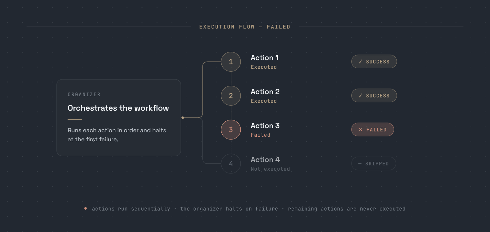
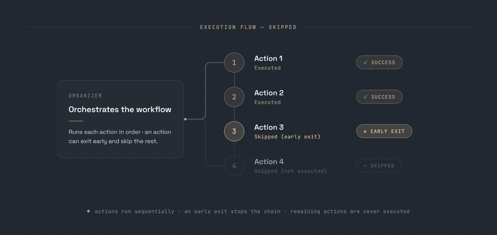

<!-- TEXT_SECTION:header:START -->

<p align="center">
    <a href="" target="_blank" rel="noopener noreferrer">
    
  </a>
</p>

<h1 align="center">
  Switchyard
</h1>
<h3 align="center">Make complex Ruby workflows readable</h3>

<br/>

<div align="center">
  <p align="center">
      <a href="https://rubygems.org/gems/switchyard"></a>
      <a href="https://github.com/ichelema/switchyard/actions/workflows/project-build.yml"></a>
      <a href="https://app.codecov.io/gh/ichelema/switchyard"></a>
      <a href="http://opensource.org/licenses/MIT"></a>
      <a href="https://rubygems.org/gems/switchyard"></a>
</p>
</div>

<!-- TEXT_SECTION:header:END -->

<br/>

## Table of Content

* [Requirements](#requirements)
* [Installation](#installation)
* [Why Switchyard?](#why-switchyard?)
* [Stopping the Series of Actions](#stopping-the-series-of-actions)
  * [Failing the Context](#failing-the-context)
  * [Skip the Remaining Actions](#skip-the-remaining-actions)
* [Benchmarking Actions with Around Advice](#benchmarking-actions-with-around-advice)
* [Before and After Action Hooks](#before-and-after-action-hooks)
* [Key Aliases](#key-aliases)
* [Logging](#logging)
* [Error Codes](#error-codes)
* [Action Rollback](#action-rollback)
* [Localizing Messages](#localizing-messages)
* [Logic in Organizers](#logic-in-organizers)
* [ContextFactory for Faster Action Testing](#contextfactory-for-faster-action-testing)
* [Functional programming](#functional-programming)
  * [Pattern](#pattern)
  * [Usage](#functional-usage)
    * [Result: Success & Failure](#functional-usage-success-failure)
    * [Result Chaining](#functional-usage-chaining)
    * [Sequencing (do-notation)](#functional-usage-sequencing)
    * [Complex Example in a Builder Action](#functional-usage-complex-action)
    * [Pattern matching](#functional-usage-pattern-matching)
    * [Option](#functional-usage-option)
    * [Coercion](#functional-usage-coercion)
    * [Enum](#functional-usage-enum)
    * [Maybe](#functional-usage-maybe)
* [Usage](#usage)

## Requirements

This gem requires ruby >= 3.1

## Installation

Add this line to your application's Gemfile:

```bash
    gem 'switchyard'
```

And then execute:

```bash
    $ bundle install
```

Or install it yourself as:

```bash
    $ gem install switchyard
```

## Why Switchyard?

Switchyard lets you organize complex workflows as a **pipeline of small actions**:

- each action lives in its own class;
- each action declares an explicit contract with `expects` and `promises`;
- the organizer shows the execution order at a glance;
- the first failure stops the remaining pipeline;
- actions can intentionally skip the remaining steps without marking the workflow as failed;
- completed actions can roll back their work when a later step fails.


Inside each action, you can write logic in a **functional style** using `Result` (`Success`/`Failure`), `Option` (`Some`/`None`), pattern matching and exception capturing with `try!`

You get both at once:

- **Readable orchestration** — the organizer describes the workflow without hiding it behind callbacks or nested conditionals.
- **Confident logic** — errors become explicit values, every step has a visible outcome, and failures compose naturally.
- **Controlled short-circuiting** — stop on failure, or skip the remaining actions while keeping the context successful.
- **Recoverable workflows** — use rollback handlers to compensate for work already completed when a later action fails.

Here is a complete login flow:

```ruby
class Authenticator
  extend Switchyard::Organizer

  def self.call(name:, password:)
    result = with(name:, password:).reduce(actions)

    logger.warn(result.message) if result.failure?

    result
  end

  def self.actions
    [
      Normalize,
      Validate,
      ConnectDb,
      GetUser,
      PrintResponse,
    ]
  end
end

class Normalize
  extend Switchyard::Action
  expects :name, :password
  promises :credentials

  executed do |ctx|
    ctx.credentials = normalize(ctx.name, ctx.password).value
  end

  def self.normalize(name, password)
    ctx.try! do
      {
        name: name.strip.downcase,
        password: password.strip,
      }
    end.map_err do
      ctx.fail_and_return!("Error in normalize method")
    end
  end

  private_class_method :normalize
end

class Validate
  extend Switchyard::Action
  expects :credentials

  executed do |ctx|
    validate_params(ctx.credentials).match do
      None() { ctx.Success(nil) }
      Some() { |error| ctx.fail_and_return!(error) }
    end
  end

  def self.validate_params(params)
    return ctx.Some("Name cannot be empty") if ctx.Option.any?(params[:name]).none?
    return ctx.Some("Password cannot be empty") if ctx.Option.any?(params[:password]).none?

    ctx.None
  end

  private_class_method :validate_params
end

class ConnectDb
  extend Switchyard::Action

  executed do |ctx|
    ctx.try! do
      raise "Database connection failed" if rand(0..1) == 1
    end.map_err { |n| ctx.fail!(n.message) }
  end
end

class GetUser
  extend Switchyard::Action
  expects :credentials
  promises :user

  executed do |ctx|
    user = Success(ctx.credentials[:name]) >>
           method(:fetch_name) >>
           method(:check_password)

    ctx.user = user.value
  end

  def self.fetch_name(name)
    user = FAKEDB.find { |_id, data| data[:name] == name }

    ctx.fail_and_return!("Name not found in DB") unless user

    Success(user)
  end

  def self.check_password(user)
    password = ctx.credentials[:password]

    ctx.fail_and_return!("Password is not correct") unless user.last[:password] == password

    Success(user)
  end

  private_class_method :fetch_name, :check_password
end

class PrintResponse
  extend Switchyard::Action
  expects :user

  executed do |ctx|
    id, user = ctx.user

    logger.info("Login successful id: #{id} name: #{user[:name]}")
  end
end

Authenticator.call(name: "foo", password: "bar")
```


## Your first action

An action is a small, self-contained unit of work. It declares the data it needs with `expects` and the data it produces with `promises`.

```ruby
class GetUser
  extend Switchyard::Action

  expects :name
  promises :user

  executed do |ctx|
    user = FAKEDB.find { |_id, data| data[:name] == name }

    ctx.fail_and_return!("Name not found in DB") unless user

    ctx.user = user
  end
end
```

You can execute an action directly without an organizer:

```ruby
result = GetUser.execute(name: "Foo")

if result.success?
    _id, user = result.user

    puts "Welcome, #{user[:name]}! Authentication completed successfully."
else
    puts "Authentication failed: #{result.message}"
end
```

`expects :name` defines the input contract of the action. Before execution, Switchyard verifies that `name` is present in the context.

`promises :user` defines its output contract. When the action completes successfully, it must add `user` to the context.

If no matching user exists, `fail_and_return!` marks the context as failed and immediately stops the action.

## Stopping the Series of Actions

Switchyard can stop a workflow in two different ways:

1. **Fail the context** — stops the pipeline and marks the result as failed.
2. **Skip the remaining actions** — stops the pipeline while keeping the result successful.

### Failing the Context

When an action encounters an unrecoverable error, call `context.fail!` to mark the context as failed (`context.failure? #=> true`) and abort the pipeline:



You can pass an optional message to describe what went wrong:

```
context.fail!("Authentication failed")
```

The current action can finish its execution, but the organizer will skip every remaining action and return the failed context to the caller.

When the action must stop immediately, use `context.fail_and_return!`:

```
context.fail_and_return!("Authentication failed")
```

It marks the context as failed and exits the current `executed` block, ensuring that no subsequent code inside the action is executed.

For example, `CheckPassword` stops authentication when the provided password does not match the user's password.

```ruby
class CheckPassword
  extend Switchyard::Action

  expects :user, :password
  promises :authenticated

  executed do |context|
    _user_id, user_data = context.user

    unless user_data[:password] == context.password
      context.fail_and_return!("Password is not correct")
    end

    context.authenticated = true
  end
end
```

If the password is invalid, the action stops immediately, the context is marked as failed, and every remaining action in the organizer is skipped.

### Skip the Remaining Actions

To short‑circuit the pipeline without marking the context as failed, call `context.skip_remaining!`. It behaves like `fail!`, but the context remains **successful**, so downstream code can still treat the result as OK.

Typical use case: you run the first few actions, perform a check, and if everything is already fine you can avoid processing the rest.



```ruby
class CheckOrderStatus
  extend Switchyard::Action
  expects :order

  executed do |context|
    if context.order.already_notified?
      context.skip_remaining!("Notification already sent, no need to execute the rest of the actions")
    end
  end
end
```

### Skipping Everything, Including Nested Scopes

`skip_remaining!` is scoped: constructs like `reduce_if` or `iterate` reset it
at their boundary, so it only exits the **current** scope. When you need to stop
the whole organizer from inside a nested construct, use
`context.skip_all_remaining!` — it is never reset, so every remaining step (in
the current scope and in the outer ones) is skipped while the context stays
successful:

```ruby
class StopsEverythingAction
  extend Switchyard::Action
  expects :item

  executed do |context|
    if context.item.poison_pill?
      context.skip_all_remaining!("Poison pill found, stopping the pipeline")
    end
  end
end
```

## Benchmarking Actions with Around Advice

When you need to profile a pipeline, adding timing code inside every single
action clutters your business logic.  
Instead, use the organizer’s `around_each` hook, which wraps each action call
as it is reduced in order.

```ruby
class LogDuration
  def self.call(context)
    start_time = Time.now
    result = yield           # run the wrapped action
    duration = Time.now - start_time
    Switchyard::Configuration.logger.info(
      :action   => context.current_action,
      :duration => duration
    )

    result
  end
end

class CalculatesTax
  extend Switchyard::Organizer

  def self.call(order)
    with(:order => order).around_each(LogDuration).reduce(
        LooksUpTaxPercentageAction,
        CalculatesOrderTaxAction,
        ProvidesFreeShippingAction
      )
  end
end
```

Any object you pass to around_each must implement:

```ruby
def self.call(context, &block)
  # …before logic…
  result = yield   # executes the action
  # …after logic…
  result
end
```

This design lets you measure—or audit—every action without polluting
the actions themselves.

## Before and After Action Hooks

Sometimes you need to run code **right before** or **right after** each action.  
Switchyard lets you do that with the `before_actions` and `after_actions` hooks.  
Each hook accepts one (or many) lambdas that will be invoked by the organizer, keeping
instrumentation neatly separated from business logic.

### Example without hooks

```ruby
class SomeOrganizer
  extend Switchyard::Organizer

  def self.call(ctx)
    with(ctx).reduce(actions)
  end

  def self.actions
    [
      OneAction,
      TwoAction,
      ThreeAction
    ]
  end
end

class TwoAction
  extend Switchyard::Action
  expects :user, :logger

  executed do |ctx|
    # Logging information
    if ctx.user.role == 'admin'
       ctx.logger.info('admin is doing something')
    end

    ctx.user.do_something
  end
end
```

Logging overwhelms the real work in TwoAction.
Let’s move that concern into hooks.

### Option 1 — declare hooks inside the organizer

```ruby
class SomeOrganizer
  extend Switchyard::Organizer
  before_actions (lambda do |ctx|
                           if ctx.current_action == TwoAction
                             return unless ctx.user.role == 'admin'
                             ctx.logger.info('admin is doing something')
                           end
                         end)
  after_actions (lambda do |ctx|
                          if ctx.current_action == TwoAction
                            return unless ctx.user.role == 'admin'
                            ctx.logger.info('admin is DONE doing something')
                          end
                        end)

  def self.call(ctx)
    with(ctx).reduce(actions)
  end

  def self.actions
    [
      OneAction,
      TwoAction,
      ThreeAction
    ]
  end
end

class TwoAction
  extend Switchyard::Action
  expects :user

  executed do |ctx|
    ctx.user.do_something
  end
end
```

Now TwoAction is pure business logic.
Because ctx.current_action holds the class of the action being run, the hooks fire
only for TwoAction, not OneAction or ThreeAction.

### Option 2 — attach hooks from the outside

```ruby
SomeOrganizer.before_actions =
  lambda do |ctx|
    if ctx.current_action == TwoAction
      return unless ctx.user.role == 'admin'
      ctx.logger.info('admin is doing something')
    end
  end
```

These ideas are originally from Aspect Oriented Programming, read more about them [here](https://en.wikipedia.org/wiki/Aspect-oriented_programming).

## Expects and Promises

Two handy macros define the contract of every action:

| Macro      | Purpose                                                         |
| ---------- | --------------------------------------------------------------- |
| `expects`  | Declares which keys **must** be present before the action runs. |
| `promises` | Declares which keys **must** exist after the action finishes.   |

If either rule is violated, Switchyard raises a dedicated exception.

### Basic usage

```ruby
class FooAction
  extend Switchyard::Action

  expects   :baz
  promises  :bar

  executed do |context|
    baz = context.fetch(:baz)   # guaranteed to be present
    context[:bar] = baz + 2     # fulfils the promise
  end
end
```

### Built‑in readers and writers

The macros do more than validation:
expects adds an accessor reader, so you can reference keys directly.
promises adds an accessor writer, so you can assign without touching the hash.
Refactored, the action is cleaner:

```ruby
class FooAction
  extend Switchyard::Action

  expects   :baz
  promises  :bar

  executed do |context|
    context.bar = context.baz + 2
  end
end
```

Want to see it in practice? Check out [this spec](spec/action_expects_and_promises_spec.rb) test file.

### Default values for expected keys

An expected key can declare a `default`, used when the key is missing from the
context (also when the action runs inside an organizer). The default can be a
static value or a lambda receiving the context:

```ruby
class GreetsSomeoneAction
  extend Switchyard::Action

  expects :name
  expects :greeting, :default => "Hello"
  expects :message,  :default => ->(ctx) { "#{ctx[:greeting]}, #{ctx[:name]}!" }

  executed do |context|
    puts context.message
  end
end

GreetsSomeoneAction.execute(:name => "Rick") # ⇒ "Hello, Rick!"
```

Note that `expects` accepts a single key when a default is given, and any
keyword other than `default` raises `UnusableExpectKeyDefaultError` at class
definition time. Keys already reachable through an alias are considered
present, so their default is not applied.

## Key Aliases

Need to wire together actions that use different key names?  
Declare key mappings once in the organizer with the `aliases` macro and every
action can read or write the value under its preferred name.

```ruby
class AnOrganizer
  extend Switchyard::Organizer

  aliases :my_key => :key_alias

  def self.call(order)
    with(:order => order).reduce(
      AnAction,
      AnotherAction,
    )
  end
end

class AnAction
  extend Switchyard::Action
  promises :my_key

  executed do |context|
    context.my_key = "value"
  end
end

class AnotherAction
  extend Switchyard::Action
  expects :key_alias

  executed do |context|
    context.key_alias # => "value"
  end
end
```

## Logging

Turning on logging is the easiest way to see what happens inside a pipeline:  
which organizer is called, which actions run, which keys appear in the context, and when something goes wrong.

Logging is **disabled by default**. Enable it in your app’s configuration:

```ruby
Switchyard::Configuration.logger = Logger.new(STDOUT)
```

To silence it, point the logger at nil or /dev/null:

```ruby
Switchyard::Configuration.logger = Logger.new('/dev/null')
```

Run an organizer and you’ll see output like:

```bash
I, [DATE]  INFO -- : [Switchyard] - calling organizer <TestDoubles::MakesTeaAndCappuccino>
I, [DATE]  INFO -- : [Switchyard] -     keys in context: :tea, :milk, :coffee
I, [DATE]  INFO -- : [Switchyard] - executing <TestDoubles::MakesTeaWithMilkAction>
I, [DATE]  INFO -- : [Switchyard] -   expects: :tea, :milk
I, [DATE]  INFO -- : [Switchyard] -   promises: :milk_tea
I, [DATE]  INFO -- : [Switchyard] -     keys in context: :tea, :milk, :coffee, :milk_tea
I, [DATE]  INFO -- : [Switchyard] - executing <TestDoubles::MakesLatteAction>
I, [DATE]  INFO -- : [Switchyard] -   expects: :coffee, :milk
I, [DATE]  INFO -- : [Switchyard] -   promises: :latte
I, [DATE]  INFO -- : [Switchyard] -     keys in context: :tea, :milk, :coffee, :milk_tea, :latte
```

The log provides a blueprint of the series of actions. You can see what organizer is invoked, what actions
are called in what order, what do the expect and promise and most importantly what keys you have in the context
after each action is executed.

Failures are logged at WARN level:

```bash
W, [DATE]  WARN -- : [Switchyard] - :-((( <TestDoubles::MakesLatteAction> has failed...
W, [DATE]  WARN -- : [Switchyard] - context message: Can't make a latte from a milk that's too hot!
```

Skipping the remaining actions is also reported:

```bash
I, [DATE]  INFO -- : [Switchyard] - calling organizer <TestDoubles::MakesCappuccinoSkipsAddsTwo>
I, [DATE]  INFO -- : [Switchyard] -     keys in context: :milk, :coffee
I, [DATE]  INFO -- : [Switchyard] - ;-) <TestDoubles::MakesLatteAction> has decided to skip the rest of the actions
I, [DATE]  INFO -- : [Switchyard] - context message: Can't make a latte with a fatty milk like that!
```

Need different log destinations per organizer? Override the global logger:

```ruby
class FooOrganizer
  extend Switchyard::Organizer
  log_with Logger.new("/my/special.log")
end
```

## Error Codes

Sometimes you need more structure than a free‑text error message.
fail! and fail_and_return! accept an error_code: keyword so you can branch on well‑defined codes later.

```ruby
class FooAction
  extend Switchyard::Action

  executed do |context|
    result = external_service.call

    unless result.success?
      context.fail!(
        "Service call failed",
        error_code: 1001
      )
    end

    unless entity.save
      context.fail!(
        "Saving the entity failed",
        error_code: 2001
      )
    end
  end
end
```

Organizers or downstream actions can then react to specific codes:

```ruby
result = FooOrganizer.call

case result.error_code
when 1001 then retry_later
when 2001 then alert_ops_team
end
```

## Action Rollback

Sometimes an action must **undo** its work if a later step fails.  
Example: one action saves records to the database, the next calls an external
API. If the API call blows up, you want to delete the records you just saved.
That’s exactly what the `rolled_back` macro is for.

```ruby
class SaveEntities
  extend Switchyard::Action
  expects :user

  executed do |context|
    context.user.save!
  end

  rolled_back do |context|
    context.user.destroy
  end
end
```

Trigger a rollback by calling context.fail_with_rollback!.
Rollback begins with the failing action and walks back through the already
executed actions in reverse order.

```ruby
class CallExternalApi
  extend Switchyard::Action

  executed do |context|
    api_call_result = SomeAPI.save_user(context.user)

    context.fail_with_rollback!("Error when calling external API") if api_call_result.failure?
  end
end
```

Declaring rolled_back is optional. If an action makes no persistent changes,
there’s nothing to undo—skip it.

### Using rollbackable actions standalone

When an action is executed outside an organizer via .execute, any
fail_with_rollback! will raise a FailWithRollbackError (an organizer needs
the exception to traverse the chain).

If you don’t want to wrap the call in begin … rescue, check whether the
action is running inside an organizer:

```ruby
class FooAction
  extend Switchyard::Action

  executed do |context|
    # context.organized_by will be nil if run from an action,
    # or will be the class name if run from an organizer
    if context.organized_by.nil?
      context.fail!
    else
      context.fail_with_rollback!
    end
  end
end
```

For a full example, see [this acceptance test](spec/acceptance/rollback_spec.rb)

## Localizing Messages

Symbols passed to `fail!`/`succeed!` are looked up through a localization
adapter. Two adapters ship with the gem:

- **Built-in adapter** (default): resolves messages from
  `Switchyard::LocalizationMap.instance`, a plain hash keyed by
  `Configuration.locale` (default `:en`) — no extra dependency needed:

  ```ruby
  Switchyard::LocalizationMap.instance[:en] = {
    :foo_action => {
      :light_service => {
        :failures => { :exceeded_api_limit => "Exceeded API limit" },
        :successes => { :api_call_ok => "All good" }
      }
    }
  }
  ```

- **I18n adapter**: selected automatically when your application loads the
  `i18n` gem (it is no longer a runtime dependency of this gem — add it to
  your own Gemfile if you want I18n-backed lookups).

If your app needs something more advanced, you can swap in a custom
localization adapter.

```ruby
class FooAction
  extend Switchyard::Action

  executed do |context|
    unless service_call.success?
      context.fail!(:exceeded_api_limit)

      # The failure message used here equates to:
      # I18n.t(:exceeded_api_limit, scope: "foo_action.light_service.failures")
    end
  end
end
```

### Nested classes

Look‑ups follow ActiveSupport’s underscore, just like Rails models inside modules:

```ruby
module PaymentGateway
  class CaptureFunds
    extend Switchyard::Action

    executed do |context|
      context.fail!(:funds_not_available) if api_service.failed?
      # resolves to:
      # I18n.t(:funds_not_available,
      #        scope: "payment_gateway/capture_funds.light_service.failures")
    end
  end
end
```

### Interpolation variables

Pass a hash for dynamic values:

```ruby
module PaymentGateway
  class CaptureFunds
    extend Switchyard::Action

    executed do |context|
      if api_service.failed?
        context.fail!(:funds_not_available, last_four: "1234")
      end
    end
  end
end
```

```yaml
# en.yml
payment_gateway:
  capture_funds:
    light_service:
      failures:
        funds_not_available: "Unable to process your payment for account ending in %{last_four}"
```

### Custom adapter

Need a different lookup scheme? Subclass the built‑in adapter and set it in the
configuration:

```ruby
# config/initializers/light_service.rb
Switchyard::Configuration.localization_adapter = MyLocalizer.new

# lib/my_localizer.rb
class MyLocalizer < Switchyard::I18n::LocalizationAdapter
  # change default scope to: "light_service.failures.<class_path>"
  def i18n_scope_from_class(action_class, type)
    "light_service.#{type.pluralize}.#{action_class.name.underscore}"
  end
end
```

### Retrieving the message

After an action halts with fail! or succeed!, read the translated text via:

```ruby
result = FooAction.execute(baz: 1)
puts result.message   # ⇒ "Exceeded API limit" (or localized equivalent)
```

## Logic in Organizers

The Organizer - Action combination works really well for simple use cases. However, as business logic gets more complex, or when Switchyard is used in an ETL workflow, the code that routes the different organizers becomes very complex and imperative. Let's look at a piece of code that does basic data transformations:

```ruby
class ExtractsTransformsLoadsData
  def self.run(connection)
    context = RetrievesConnectionInfo.call(connection)
    context = PullsDataFromRemoteApi.call(context)

    retrieved_items = context.retrieved_items
    if retrieved_items.empty?
      NotifiesEngineeringTeamAction.execute(context)
    end

    retrieved_items.each do |item|
      context[:item] = item
      TransformsData.call(context)
    end

    context = LoadsData.call(context)

    SendsNotifications.call(context)
  end
end
```

### Declarative version

```ruby
class ExtractsTransformsLoadsData
  extend Switchyard::Organizer

  def self.call(connection)
    with(:connection => connection).reduce(actions)
  end

  def self.actions
    [
      RetrievesConnectionInfo,
      PullsDataFromRemoteApi,
      reduce_if(->(ctx) { ctx.retrieved_items.empty? }, [
        NotifiesEngineeringTeamAction
      ]),
      iterate(:retrieved_items, [
        TransformsData
      ]),
      LoadsData,
      SendsNotifications
    ]
  end
end
```

The declarative style is shorter, easier to scan, and keeps flow control out of
your actions.

### Organizer constructs

| Construct                                                          | Declarative “equivalent” | What it does (in one line)                                                                  |
| ------------------------------------------------------------------ | ------------------------ | ------------------------------------------------------------------------------------------- |
| [reduce_until](spec/acceptance/organizer/reduce_until_spec.rb)     | `until` loop             | Keeps reducing the listed steps **until** the lambda returns `true`.                        |
| [reduce_while](spec/acceptance/organizer/reduce_while_spec.rb)     | `while` guard            | Checks the lambda **before each step** and stops as soon as it returns `false`.             |
| [reduce_if](spec/acceptance/organizer/reduce_if_spec.rb)           | `if`                     | Reduces its sub‑steps **only if** the lambda returns `true`.                                |
| [reduce_if_else](spec/acceptance/organizer/reduce_if_else_spec.rb) | `if/else`                | Reduces the first list of steps when the lambda is `true`, the second one otherwise.        |
| [reduce_case](spec/acceptance/organizer/reduce_case_spec.rb)       | `case/when`              | Dispatches to the steps matching a context value (`:value`, `:when`, `:else` kwargs).       |
| [iterate](spec/acceptance/organizer/iterate_spec.rb)               | `each` loop              | Loops over a collection key; each element is exposed under the **singular** name.           |
| [execute](spec/acceptance/organizer/execute_spec.rb)               | one‑off lambda           | Runs an inline lambda or block for quick context tweaks (add keys, transform values, etc.). |
| [with_callback](spec/acceptance/organizer/with_callback_spec.rb)   | streaming callback       | Defers execution like a SAX parser—great for huge inputs without loading everything in RAM. |
| [add_to_context](spec/acceptance/organizer/add_to_context_spec.rb) | N/A (context inject)     | Injects key–value pairs into the context (defining accessors) before the next steps run.    |
| [add_aliases](spec/acceptance/organizer/add_aliases_spec.rb)       | key aliasing             | Creates an alias so actions can read/write the same value under different names.            |

All ten are covered by acceptance tests in spec/acceptance/organizer/*_spec.rb.

**Tip**: When iterating, the collection must already be in the context.
iterate(:items) expects context[:items]; it then places each element under
context.item for the inner actions.

```ruby
iterate(:items, [ProcessItem])
# Inside ProcessItem → context.item
```

Need a quick context mutation? Use execute, with a lambda or a block:

```ruby
execute(->(c) { c[:some_values] = c.some_hash.values })
# or
execute { |c| c[:some_values] = c.some_hash.values }
```

Need to branch on a context value? Use reduce_case:

```ruby
reduce_case :value => :status,
            :when => {
              :active   => [NotifiesUserAction],
              :archived => [ArchivesRecordAction]
            },
            :else => [RaisesUnknownStatusAction]
```

## ContextFactory for Faster Action Testing

As workflows grow more complex, building a realistic
`Switchyard::Context` for unit tests can become painful.
Factory objects help, but the data you assemble by hand may still differ
from what earlier actions really produce—especially in ETL pipelines where
each step mutates the context.

### Example pipeline:

```ruby
class SomeOrganizer
  extend Switchyard::Organizer

  def self.call(ctx)
    with(ctx).reduce(actions)
  end

  def self.actions
    [
       ETL::ParsesPayloadAction,
       ETL::BuildsEnititiesAction,
       ETL::SetsUpMappingsAction,
       ETL::SavesEntitiesAction,
       ETL::SendsNotificationAction
    ]
  end
end
```

You should test your workflow from the outside, invoking the organizer’s `call` method and verify that the data was properly created or updated in your data store. However, sometimes you need to zoom into one action, and setting up the context to test it is tedious work. This is where `ContextFactory` can be helpful.

### Enter ContextFactory

Switchyard::Testing::ContextFactory can generate a
pre-populated context that mirrors real runtime data, letting you focus on
the behaviour you want to test.

```ruby
require "spec_helper"
require "light-service/testing"

RSpec.describe ETL::SetsUpMappingsAction do
  let(:context) do
    Switchyard::Testing::ContextFactory
      .make_from(SomeOrganizer)          # build the full pipeline
      .for(described_class)              # stop right before our action
      .with(payload: File.read("spec/data/payload.json"))
  end

  it "sets up mappings correctly" do
    result = described_class.execute(context)
    expect(result).to be_success
  end
end
```

No more 20-line fixture setup—just a realistic context ready to go.

If your organizer contains additional logic in its own call method,
create a test-only organizer inside your specs.
See [acceptance test](spec/acceptance/testing/context_factory_spec.rb#L4-L11) for a full example.

## Functional Programming

Switchyard lets you write **confident**, side-effect-aware Ruby by
offering monads and algebraic data types (ADTs) you can compose and pattern-match
without boilerplate.

### Pattern Overview

| Monad / ADT                      | When to use it                                                                                                          | Typical flow control                            |
| -------------------------------- | ----------------------------------------------------------------------------------------------------------------------- | ----------------------------------------------- |
| **Result** (`Success / Failure`) | An operation can **succeed or fail** and the *value matters* either way.                                                | Short-circuit on the first `Failure`.           |
| **Option** (`Some / None`)       | An operation may return **a value or nothing**, and *why it’s missing doesn’t matter*. Think collections or cache hits. | Run every step, keep only the `Some` results.   |
| **Maybe**                        | Wrap any object that *might be `nil`* to avoid endless `nil?` checks.                                                   | Chain safe calls; `Null` swallows method calls. |
| **Enums** (custom ADTs)          | Define your own tagged unions when the built-ins don’t fit.                                                             | Full pattern-matching support.                  |

### Usage

### Result – Success / Failure

```ruby
Success(1).to_s                        # => "1"
Success(Success(1))                    # => Success(1)

Failure(1).to_s                        # => "1"
Failure(Failure(1))                    # => Failure(1)
```

#### Mapping and binding

```ruby
Success(1).fmap { |v| v + 1 }                     # => Success(2)
Failure(1).bind { |v| Success(v - 1) }            # => Success(0)

Success(1).map     { |n| Success(n + 1) }         # => Success(2)
Failure(1).map_err { |n| Success(n + 1) }         # => Success(2)
```

#### Flow helpers

```ruby
Success(1).and Success(2)                         # => Success(2)
Success(1).and_then { Success(2) }                # => Success(2)

Failure(1).or Success(99)                         # => Success(99)
Failure(1).or_else { |n| Success(n + 1) }         # => Success(2)
```

#### Exception capturing

```ruby
include Switchyard::Prelude::Result

try! { 1 }                             # => Success(1)
try! { raise "hell" }                  # => Failure(#<RuntimeError: hell>)
try! { risky_call }                    # => Success(result) or Failure(err)
```

### Result Chaining <a name="functional-usage-chaining"></a>

You can easily chain the execution of several operations. Here we got some nice function composition.
The method must be a unary function, i.e. it always takes one parameter - the context, which is passed from call to call.

The following aliases are defined

```ruby
alias :>> :map
alias :<< :pipe
```

This allows the composition of procs or lambdas and thus allow a clear definiton of a pipeline.

```ruby
Success(params) >>
  validate >>
  build_request << log >>
  send << log >>
  build_response
```

### Sequencing (do-notation) – in_sequence

When a pipeline needs the intermediate values of earlier steps, chaining alone
gets awkward. `in_sequence` (ported from the [deterministic](https://github.com/pzol/deterministic)
gem, MIT License) gives you a do-notation style block: each step returns a
`Result`, the sequence short-circuits on the first `Failure`, and values bound
with `get`/`let` are available to all subsequent steps by name.

```ruby
class DownloadRemit
  include Switchyard::Prelude

  def call(row)
    in_sequence do
      get(:url)      { extract_url(row) }        # binds the Success value to :url
      get(:file)     { fetch(url) }              # :url is available here
      let(:name)     { File.basename(url) }      # binds a plain (non-Result) value
      and_then       { validate(file) }          # step without binding
      observe        { logger.info("got #{name}") } # side effect, return value ignored
      and_yield      { Success(name) }           # final result of the sequence
    end
  end
end
```

* `get(:name) { ... }` – runs a step returning a `Result`; on `Success` binds the
  unwrapped value to `name`, on `Failure` stops the sequence and returns it.
* `let(:name) { ... }` – binds the block's plain return value (no `Result` involved).
* `and_then { ... }` – runs a step returning a `Result` without binding its value.
* `observe { ... }` – runs a side effect; its return value is ignored.
* `and_yield { ... }` – mandatory final step; its `Result` is the value of the
  whole `in_sequence` block.

#### Complex Example in a Builder Action

```ruby
class Foo
  extend Switchyard::Action
  expects :params
  alias :m :method

  executed do |ctx|
    Success(ctx.params) >> m(:validate) >> m(:send)
  end

  def self.validate(params)
    # do stuff
    Success(validate_and_cleansed_params)
  end

  def self.send(clean_params)
    # do stuff
    Success(result)
  end
end

class Bar
  extend Switchyard::Organizer

  def self.call(params)
    with(:params => params).reduce(Foo)
  end
end

Bar.call # Success(3)
```

Chaining works with blocks (`#map` is an alias for `#>>`)

```ruby
Success(1).map {|ctx| Success(ctx + 1)}
```

it also works with lambdas

```ruby
Success(1) >> ->(ctx) { Success(ctx + 1) } >> ->(ctx) { Success(ctx + 1) }
```

and it will break the chain of execution, when it encounters a `Failure` on its way

```ruby
def works(ctx)
  Success(1)
end

def breaks(ctx)
  Failure(2)
end

def never_executed(ctx)
  Success(99)
end

Success(0) >> method(:works) >> method(:breaks) >> method(:never_executed) # Failure(2)
```

`#map` aka `#>>` will not catch any exceptions raised. If you want automatic exception handling, the `#try` aka `#>=` will catch an error and wrap it with a failure

```ruby
def error(ctx)
  raise "error #{ctx}"
end

Success(1) >= method(:error) # Failure(RuntimeError(error 1))
```

### Pattern matching

Now that you have some result, you want to control flow by providing patterns.
`#match` can match by

* success, failure, result or any
* values
* lambdas
* classes

```ruby
Success(1).match do
  Success() { |s| "success #{s}"}
  Failure() { |f| "failure #{f}"}
end # => "success 1"
```

Note1: the variant's inner value(s) have been unwrapped, and passed to the block.

Note2: only the __first__ matching pattern block will be executed, so order __can__ be important.

Note3: you can omit block parameters if you don't use them, or you can use `_` to signify that you don't care about their values. If you specify parameters, their number must match the number of values in the variant.

The result returned will be the result of the __first__ `#try` or `#let`. As a side note, `#try` is a monad, `#let` is a functor.

Guards

```ruby
Success(1).match do
  Success(where { s == 1 }) { |s| "Success #{s}" }
end # => "Success 1"
```

Note1: the guard has access to variable names defined by the block arguments.

Note2: the guard is not evaluated using the enclosing context's `self`; if you need to call methods on the enclosing scope, you must specify a receiver.

Also you can match the result class

```ruby
Success([1, 2, 3]).match do
  Success(where { s.is_a?(Array) }) { |s| s.first }
end # => 1
```

If no match was found a `NoMatchError` is raised, so make sure you always cover all possible outcomes.

```ruby
Success(1).match do
  Failure() { |f| "you'll never get me" }
end # => NoMatchError
```

Matches must be exhaustive, otherwise an error will be raised, showing the variants which have not been covered.

### Option

```ruby
Some(1).some?                          # #=> true
Some(1).none?                          # #=> false
None.some?                             # #=> false
None.none?                             # #=> true
```

Maps an `Option` with the value `a` to the same `Option` with the value `b`.

```ruby
Some(1).fmap { |n| n + 1 }             # => Some(2)
None.fmap { |n| n + 1 }                # => None
```

Maps a `Result` with the value `a` to another `Result` with the value `b`.

```ruby
Some(1).map  { |n| Some(n + 1) }       # => Some(2)
Some(1).map  { |n| None }              # => None
None.map     { |n| Some(n + 1) }       # => None
```

Get the inner value or provide a default for a `None`. Calling `#value` on a `None` will raise a `NoMethodError`

```ruby
Some(1).value                          # => 1
Some(1).value_or(2)                    # => 1
None.value                             # => NoMethodError
None.value_or(0)                       # => 0
```

Add the inner values of option using `+`.

```ruby
Some(1) + Some(1)                      # => Some(2)
Some([1]) + Some(1)                    # => TypeError: No implicit conversion
None + Some(1)                         # => Some(1)
Some(1) + None                         # => Some(1)
Some([1]) + None + Some([2])           # => Some([1, 2])
```

### Coercion

```ruby
Option.any?(nil)                       # => None
Option.any?([])                        # => None
Option.any?({})                        # => None
Option.any?(1)                         # => Some(1)

Option.some?(nil)                      # => None
Option.some?([])                       # => Some([])
Option.some?({})                       # => Some({})
Option.some?(1)                        # => Some(1)

Option.try! { 1 }                      # => Some(1)
Option.try! { raise "error"}           # => None

Some(1).match {
  Some(where { s == 1 }) { |s| s + 1 }
  Some()                 { |s| 1 }
  None()                 { 0 }
}                                      # => 2
```

### Maybe

The simplest NullObject wrapper there can be. It adds `#some?` and `#null?` to `Object` though.

```ruby
require 'switchyard/functional/maybe' # you need to do this explicitly
Maybe(nil).foo        # => Null
Maybe(nil).foo.bar    # => Null
Maybe({a: 1})[:a]     # => 1

Maybe(nil).null?      # => true
Maybe({}).null?       # => false

Maybe(nil).some?      # => false
Maybe({}).some?       # => true
```

### Enums (custom ADTs)

All the above are implemented using enums, see their definition, for more details.

```ruby
Threenum = Switchyard::enum {
            Nullary()
            Unary(:a)
            Binary(:a, :b)
           }

Threenum.variants                      # => [:Nullary, :Unary, :Binary]
```

Initialize

```ruby
n = Threenum.Nullary                   # => Threenum::Nullary.new()
n.value                                # => Error

u = Threenum.Unary(1)                  # => Threenum::Unary.new(1)
u.value                                # => 1

b = Threenum::Binary(2, 3)             # => Threenum::Binary(2, 3)
b.value                                # => { a:2, b: 3 }
```

Pattern matching

```ruby
Threenum::Unary(5).match {
  Nullary() {        0 }
  Unary()   { |u|    u }
  Binary()  { |a, b| a + b }
}                                      # => 5

# or
t = Threenum::Unary(5)
Threenum.match(t) {
  Nullary() {        0 }
  Unary()   { |u|    u }
  Binary()  { |a, b| a + b }
}                                      # => 5
```

If you want to return the whole matched object, you'll need to pass a reference to the object (second case). Note that `self` refers to the scope enclosing the `match` call.

```ruby
def drop(n)
  match {
    Cons(where { n > 0 }) { |h, t| t.drop(n - 1) }
    Cons()                { |_, _| self }
    Nil() { raise EmptyListError }
  }
end
```

See the linked list implementation in the specs for more examples

With guard clauses

```ruby
Threenum::Unary(5).match {
  Nullary() {     0 }
  Unary()   { |u| u }
  Binary(where { a.is_a?(Fixnum) && b.is_a?(Fixnum) }) { |a, b| a + b }
  Binary()  { |a, b| raise "Expected a, b to be numbers" }
}                                      # => 5
```

#### Add methods with impl

```ruby
Switchyard::impl(Threenum) {
  def sum
    match {
      Nullary() {        0 }
      Unary()   { |u|    u }
      Binary()  { |a, b| a + b }
    }
  end

  def +(other)
    match {
      Nullary() {        other.sum }
      Unary()   { |a|    self.sum + other.sum }
      Binary()  { |a, b| self.sum + other.sum }
    }
  end
}

Threenum.Nullary + Threenum.Unary(1)   # => Unary(1)
```

All matches must be exhaustive; otherwise NoMatchError is raised.

## Usage

Based on the refactoring example above, just create an organizer object that calls the
actions in order and write code for the actions. That's it.

For further examples, please visit the project's [Wiki](https://github.com/ichelema/switchyard/wiki).

## Upgrading to 6.0

Version 6.0 requires **Ruby >= 3.1** and ships a few breaking changes plus new guarantees.
They come from a full technical audit (see `AUDIT-switchyard.md`).

### Breaking changes

- **`Context#fetch` now honours the `Hash#fetch` contract**: `fetch(:missing)` without a
  default raises `KeyError` (it used to return `nil`) and fetch never writes to the
  context anymore.
- **Aliases are pure alternative names**: reads *and* writes on an alias resolve to the
  original key. `assign_aliases` no longer copies values, so `to_h` contains only the
  original keys.
- **Key collisions raise**: declaring `expects :size` (or any key that clashes with an
  existing `Hash`/`Context` method) raises `ReservedKeysInContextError` instead of
  silently returning the wrong value. Access such data via `ctx[:size]` instead.
- **`Some(nil)` raises `ArgumentError`**: absence is expressed with `None`.
- **`Context#outcome` is read-only**: use `succeed!`/`fail!` to change the outcome.
- The infrastructure keys `:_aliases`, `:_before_actions` and `:_after_actions` are
  reserved and cannot be used in `expects`/`promises`.

### New guarantees and features

- **Declarative hooks are stable**: `before_actions`/`after_actions` declared on anorganizer now apply to *every* call (they used to disappear after the first one).

- **Rollback is complete** even when the same action class appears more than once in the pipeline.

- **Native pattern matching**: every enum variant supports `case/in`:

  ```ruby
  case result
  in Switchyard::Result::Success[value] then value
  in Switchyard::Result::Failure[error] then handle(error)
  end
  ```

  For hot paths prefer `case/in` (or `success?`/`value`) over the `match` DSL: it is
  roughly two orders of magnitude faster.

- **`skip_remaining!` is scoped**: inside `iterate`/`reduce_if`/`reduce_until` it skips
  the remaining *steps of the current sub-pipeline* (for `iterate`: of the current item),
  then the outer flow continues. The outcome message set by `skip_remaining!` is preserved.

- **Deprecations** (still working, warn once on stderr): `Maybe()`/`Null` (use
  `Option`), `Result#>=` (use `try`), `Result#<<` (use `pipe`), `Result#+`/`Option#+`.
  Silence them with `Switchyard::Deprecations.silenced = true`.

### Threading contract

A `Context` is a per-call object: create it inside each organizer call (which is what
`with` does) and do not share a live context between threads. Class-level state
(hooks, aliases, logger) is read-only at call time, so calling the same organizer from
multiple threads (Puma, Sidekiq) is safe.

<br/>
<!-- TEXT_SECTION:contributing:START -->
## Contributing

1. Fork it
2. Create your feature branch (`git checkout -b my-new-feature`)
3. Commit your changes (`git commit -am 'Added some feature'`)
4. Push to the branch (`git push origin my-new-feature`)
5. Create new Pull Request

Huge thanks to the [contributors](https://github.com/ichelema/switchyard/graphs/contributors)!
<br/>
<!-- TEXT_SECTION:changelog:END -->

<!-- TEXT_SECTION:changelog:START -->
## Changelog

Follow the changelog in this [document](https://github.com/ichelema/switchyard/blob/master/CHANGELOG.md).
<br/>
<!-- TEXT_SECTION:changelog:END -->

<!-- TEXT_SECTION:contribute:START -->
## Thank You

A very special thank you to [Attila Domokos](https://github.com/adomokos) for
his fantastic work on [LightService](https://github.com/adomokos/light-service).
A very special thank you to [Piotr Zolnierek](https://github.com/pzol) for
his fantastic work on [Deterministic](https://github.com/pzol/deterministic).
Switchyard is inspired heavily by the concepts put to code by Attila and add some functionality taken from the excellent work of Piotr.
<br/>
<!-- TEXT_SECTION:contribute:END -->

<!-- TEXT_SECTION:license:START -->
## License

Switchyard is released under the [MIT License](http://www.opensource.org/licenses/MIT).
<!-- TEXT_SECTION:license:END -->
